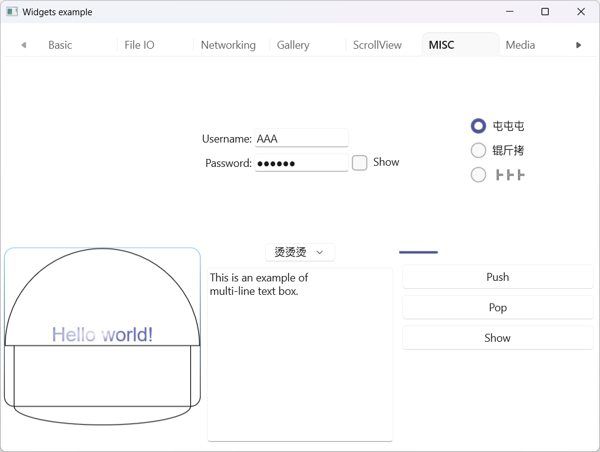
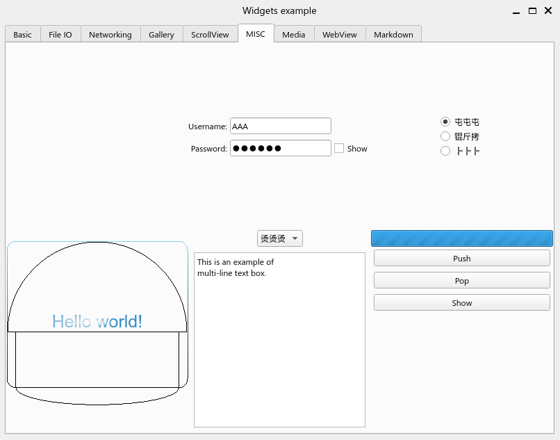

# Winio

Winio is a single-threaded asynchronous GUI runtime.
It is based on [`compio`](https://github.com/compio-rs/compio), and the GUI part is powered by Win32, WinUI 3, Qt 5/6, GTK 4 or AppKit.
All IO requests could be issued in the same thread as GUI, without blocking the user interface!

## Example

Read the [examples](winio/examples) and learn more!

| Backend | Light                                  | Dark                                 |
| ------- | -------------------------------------- | ------------------------------------ |
| Win32   |  |  |
| WinUI 3 |  |  |
| Qt 6    |        |        |
| GTK 4   |      |      |
| AppKit  |    |    |

## Quick start

Winio follows ELM-like design, inspired by [`yew`](https://yew.rs/) and [`relm4`](https://relm4.org/).
The application starts with a root `Component`:

```rust
use winio::prelude::*;

fn main() {
    App::new("rs.compio.winio.example").run::<MainModel>(());
}

struct MainModel {
    window: Child<Window>,
}

enum MainMessage {
    Noop,
    Close,
}

impl Component for MainModel {
    type Event = ();
    type Init<'a> = ();
    type Message = MainMessage;

    fn init(_init: Self::Init<'_>, _sender: &ComponentSender<Self>) -> Self {
        // create & initialize the window
        init! {
            window: Window = (()) => {
                text: "Example",
                size: Size::new(800.0, 600.0),
            }
        }
        window.show();
        Self { window }
    }

    async fn start(&mut self, sender: &ComponentSender<Self>) -> ! {
        // listen to events
        start! {
            sender, default: MainMessage::Noop,
            self.window => {
                WindowEvent::Close => MainMessage::Close,
            }
        }
    }

    async fn update_children(&mut self) -> bool {
        // update the window
        self.window.update().await
    }

    async fn update(&mut self, message: Self::Message, sender: &ComponentSender<Self>) -> bool {
        // deal with custom messages
        match message {
            MainMessage::Noop => false,
            MainMessage::Close => {
                // the root component output stops the application
                sender.output(());
                // need not to call `render`
                false
            }
        }
    }

    fn render(&mut self, _sender: &ComponentSender<Self>) {
        let csize = self.window.client_size();
        // adjust layout and draw widgets here
    }

    fn render_children(&mut self) {
        self.window.render();
    }
}
```
